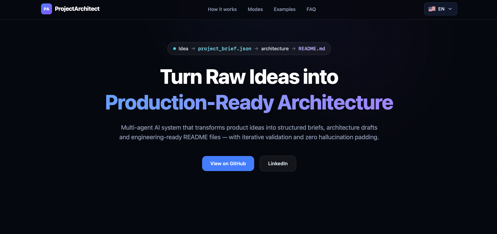
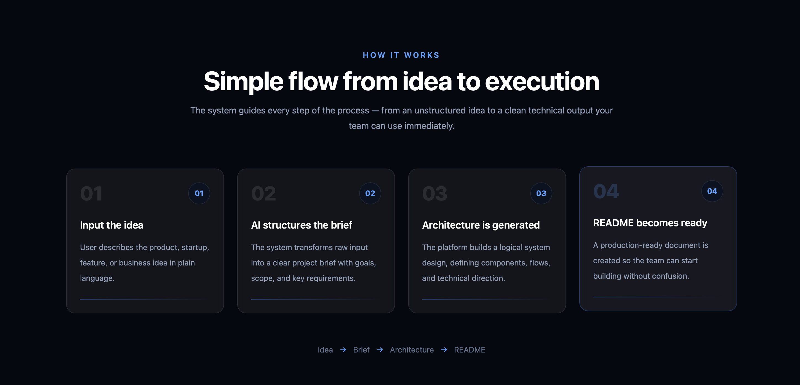
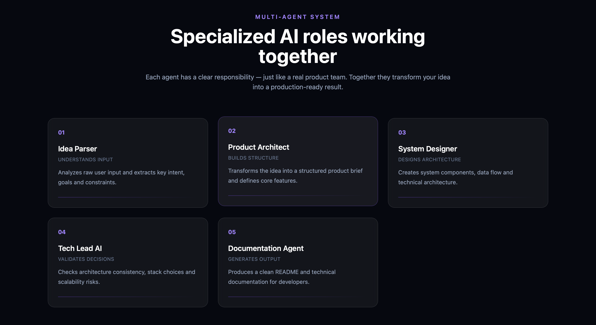
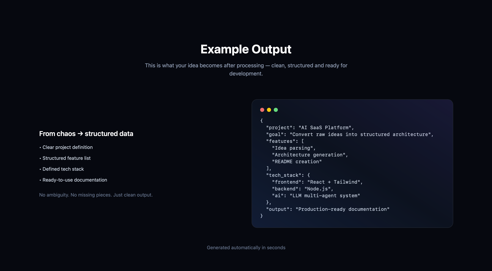
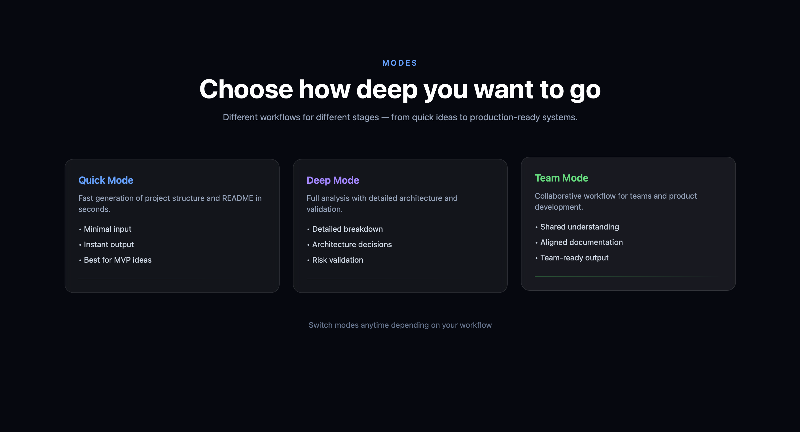

# 🚀 ProjectArchitect

Landing page for an AI startup that transforms raw ideas into structured product architecture.

---

## 🌐 Live Demo

👉 https://k1mone.github.io/Pr-architech/

---

## 🧠 About the Project

ProjectArchitect is a landing page for a concept AI platform that:

- converts raw ideas into structured project briefs
- generates system architecture
- creates developer-ready README documentation

The goal of this landing page is to present the product clearly and explain how it works to users, founders, and developers.

---

## 🎯 Purpose

This project demonstrates:

- product thinking
- UI/UX design for tech startups
- clear communication of complex systems
- modern frontend development

---

## 🏗️ Structure

The landing page consists of multiple sections:

- Hero (main value proposition)
- Problem → Solution
- How It Works
- Multi-Agent Roles
- Modes
- Examples
- Advantages
- Tech Intelligence
- Architecture Mindset
- FAQ
- Footer

Each section is implemented as a separate React component.

---

## 🌍 Features

- 🌐 Multi-language support (EN / RU / ZH)
- 🎨 Modern UI (Tailwind CSS)
- ⚡ Fast and optimized (Vite)
- 🧩 Component-based architecture
- 📱 Responsive design

---

## 🧠 Key Concept

The platform is based on a multi-agent AI system:

- Idea Parser
- Product Architect
- System Designer
- Tech Lead AI
- Documentation Agent

These roles simulate a real product team.

---

## 🧩 Tech Stack

- React
- TypeScript
- Vite
- Tailwind CSS

---

## 📂 Project Structure

src/
Components/
Pages/
context/
App.tsx
main.tsx

---

## 🚀 Getting Started

```bash
git clone https://github.com/K1mone/Pr-architech.git
cd project
npm install
npm run dev
```

📸 Screenshots







💼 Portfolio Note
This project is part of my portfolio and represents a startup-level concept focused on:
system architecture thinking
product design
frontend development

👤 Author
GitHub: https://github.com/K1mone
LinkedIn: https://www.linkedin.com/in/kanat-anuar-81b7093aa/

📝 License
MIT
